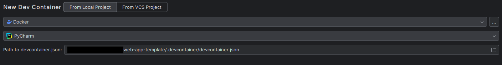

# Template for a web application

Template for the application that uses:
- `FastApi` + `Jinja` (Python) on backend
- `htmx` + `Lit components` on the frontend

## Backend

## Frontend

Frontend uses the mixture of plain `html` (in `app/templates`) that uses the `htmx` (for basic interactivity) and custom web components, created using `Lit components` (where more interactivity is required).

To create custom web components, we are using `TypeScript` + `Vite`.
Inside `index.jinja` there is a switch that changes the source from which the scripts are loaded:
- on development - from `Vite` HMR server, that compiles the sources on the fly and makes it possible to develop using hot-reloading.
- on production - from `static` dir, that will be created by `vite build` command.

Note that `fronted/index.html` exists only for `Vite` development server purposes - it is not used by the application. 

Read more about this approach [here](https://www.lorenstew.art/blog/eta-htmx-lit-stack)

## Development

**Not valid any more**
Application is meant to be developed inside the provided *devcontainer*. This ensures that development and production environments have the same dependencies.

To spin-up the dev container:
- Create a new project based on this template
- Clone a new project from Github
- Open Jetbrains Gateway or in Pycharm go `File->Remote Development`
- Select `Connections->Dev Containers->New Dev Container->From Local Project` and provide the path to cloned `.devcontainer` file

> [!NOTE]
> You can also use `From VCS Project` option but be aware of [this ticket](https://youtrack.jetbrains.com/issue/IJPL-196106). In this mode, project will be cloned ONLY ONCE and then reused. You are risking that the devcontainer won't be created with the newest code if you are not managing the jetbrains docker volumes manually.

- Select `Build Container and Continue`

**New approach*
Application is meant to be developed locally, with the provided run configuration. Each component of the application has an associated run configuration —this setup increases the ability to debug the app:
- on the frontend side, we are spinning up the `Vite` dev server, that will handle all of the `TypeScript` code that defines the web components
  - in the run configuration, we are launching the `Chrome` browser with the specified debugging port. This port will allow to debug `TypeScript/Javascript` code from Pycharm by setting the breakpoints (like any Python code)
- on the backend, we are running the `FastApi` app - to lunch it, we are using the predefined run configuration, provided by Pycharm
  - here the debugging is also as simple as setting the breakpoint
- Celery - TBD
- app dependencies like a database—those are defined in a docker compose file and also specified in run configuration. Components that require those dependencies will define `Before launch` task(s), that will spin up the docker containers specified in the `docker-compose` file.

Finally, all of those run configurations are grouped inside `Compound configuration` called **Full App**. This is really the main entrypoint for the application. Once started in debug mode, it will allow setting the breakpoints in all components of the system, without reloading or adding additional config.

### Why local development without devcontainer?

Devcontainer integration was evaluated in the context of the local development. Investigation is indicating that usage of devcontainers with Pycharm has some limitations that make them a less convenient option, compared to *raw* local development.
To name a few:
- You cannot run the browser with debugging port, to which pycharm will attach to (for `Javascript` debugging)
- Gateway UI is buggy and often hangs. For example, sometimes you are not able to rebuild/remove the devcontainer
- IDE settings are not preserved between different dev containers
- The whole process of creating the devcontainer takes some time
- AI integration in devcontainers is poor—for example, you cannot use AI features in the terminal

... and more.

Truly local development, based on the Python virtual envs and node modules, downloaded for the project, makes it much easier to develop.
The downside is the fact that when working on a production version of your app, there is a risk that the environment will not match. This can be minimized by using os that is close to production target, like `Ubuntu`.
In this approach there is still a gap between development and production setup.

How can we address it? TBD

## ToDo

- `docker-compose` shall contain only production settings - deployment from the image. `devcontainer` file(s) are build based on the Dockerfile, not `docker-compose`. `.env` file is shared - is this possible?
  - Seems like `.env` sharing is not needed - in `devcontainer`, it will be created during development (same as for local development); for `production`/`staging` env variables will be provided from the deployment pipeline
  - 